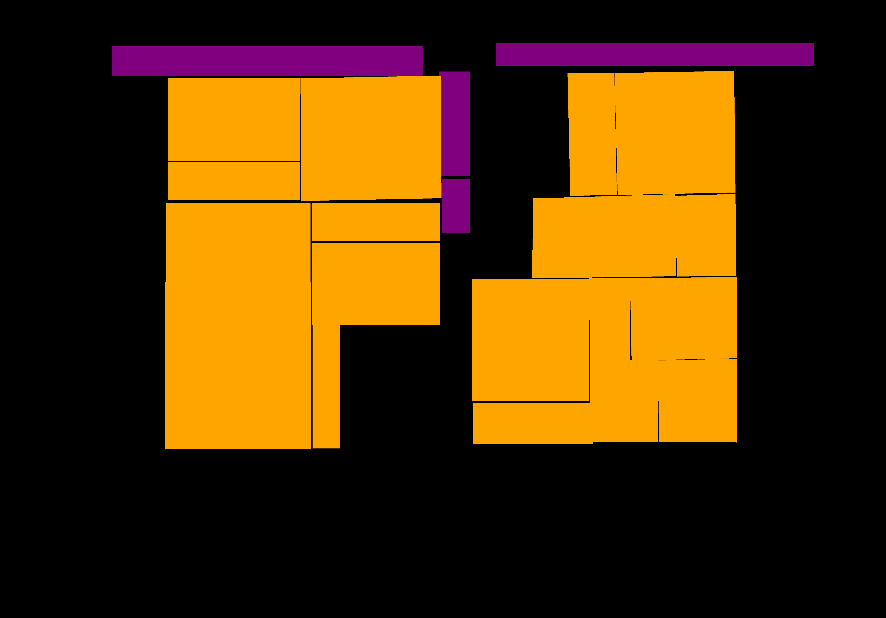

# ECPO Segmentation

## Prerequisites

This repository contains little programs for using the
[dhSegment](https://github.com/dhlab-epfl/dhSegment) tool to segment the ECPO
data. This implies a dependency on having a recent Python version (3.5 or newer)
and access to an Nvidia GPU which is used by dhSegment via Tensorflow. The
project was only tested on Linux machines, but in theory it should work on
Windows, as well.

Furthermore, fine-tuning the dhSegment model on ECPO images requires you to have
the ECPO images stored in your local filesystem and to have HTTP access to the
ECPO API storing the segmentation annotations.

The trained models in the `exp` directory are quite large and are therefore
tracked via Git LFS, so you will need to install
[git-lfs](https://github.com/git-lfs/git-lfs), preferably through your package
manager (e.g. `apt install git-lfs`).

## Installation

First, make sure that you have Python 3.6 or newer. Then install `dhSegment` by
following their [installation
procedure](https://dhsegment.readthedocs.io/en/latest/start/install.html)

Then install `ecpo_segment` by executing `pip install .` in this repository’s
root.

## Running Tests

The tests can be run via `python setup.py pytest`.

## Using the System

To see an example of using `ecpo-segment` for an actual experiment with all the
commands that have to be run, see [the experiment
`all-detection-1`](exp/all-detection-1/Report.md).

### Getting Annotations from ECPO API

The module `ecpo_segment.get_annotations` will retrieve annotations from the
ECPO API and save them as PNG files that serve as masks. For each image (i.e.
for each scan), there will be a mask of the same dimensions that consists of
black backgroud and colored polygons. Their color indicates the annotation.

Assuming the Jingbao images live in `Jingbao/images_renamed` _and the API only
returns annotations for Jingbao,_ the following command will retrieve the first
100 annotations the API returns, discard all but the annotations with label
`article` or `additional` and will then save the masks in `Jingbao/masks`.

```
python3 -m ecpo_segment.get_annotations --restrict-to-label-names article,additional --max-annotations 100 Jingbao/images_renamed
```

Execute `python3 -m ecpo_segment.get_annotations -h` to see more options,
especially for where to save the annotation masks and the associated source
images.

Here is an example of an image and its constructed annotation mask:





### Making Predictions

The module `ecpo_segment.predict` will use a trained model to segment images.
You will have to provide an input directory where your images are stored and an
output directory where the segmentation results will be stored. Additionally,
you have to supply the options `--model-dir` and `--classes-file`, in case they
differ from the default `model/` and `classes.txt`, respectively. E.g.:

```
python3 -m ecpo_segment.predict --classes-file classes.txt --model-dir model/export/1578932914 data/test/images predictions/test
```

This will read the images in `data/test/images` and use the model in
`model/export/1578932914` to make predictions that are stored in subdirectories
of `predictions/test`. The predictions are color-coded according to
`classes.txt`.


### Evaluating a Model

The module `ecpo_segment.evaluate` calculates the Intersection over Union (IoU)
for each class separately and the mean of the per-class IoUs. E.g.:

```
python3 -m ecpo_segment.evaluate predictions/test/raw data/test/labels classes.txt
```
